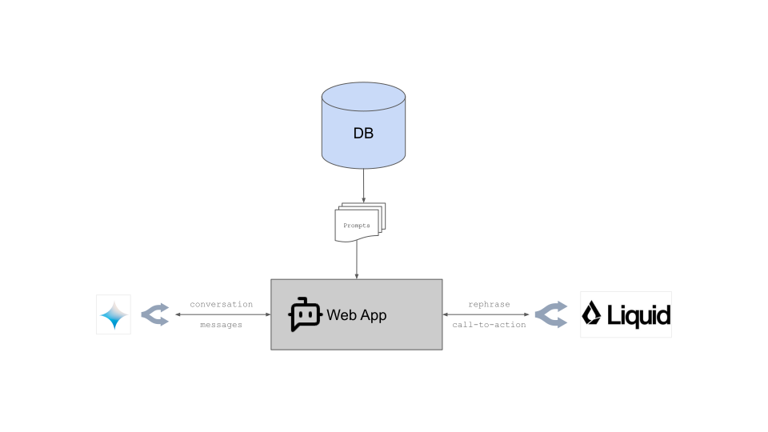
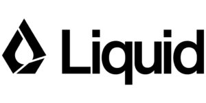

# Portfolio

This is the repository of David Álvarez Pons' portfolio, which can be visited in this link: https://davizuku.vercel.app/

## Introduction

The main purpose of this portfolio is to show the integration of an AI Assistant based on augmented generation using LLMs. The different sections contain call-to-actions to guide the user towards having a conversation with the Assistant.

## Architecture

In this section, I review different details on how the application is built.



### Tech Stack

For the main web application, I have chosen Typescript + Next.js + Vercel + Postgres on Neon due to their ease of integration and their free cost.

[](https://www.typescriptlang.org/)
[](https://nextjs.org/)
[](https://vercel.com/)
[](https://www.postgresql.org/)
[](https://neon.tech/)

### LLM integration

After trying a side-docker with Ollama, its performance was not good on my local laptop, nor I found a free hosting for such type of workload. As a consequence, for the LLM integration, I tried OpenRouter because it offered an affordable access to a big variety of models as well a quick interface to test different system prompts.

After testing multiple models I chose:
- `google/gemini-flash-1.5-8b` ([link](https://openrouter.ai/google/gemini-flash-1.5-8b)): For the conversation generation and the augmented retrieval. Chosen by a good tradeoff between price, context, and results. The amount of information from my profile is roughly above 15k tokens, which easily fits into most LLMs. This way, the results were acceptable for a quick prototype, it can become more complex in the future.
- `liquid/lfm-7b` ([link](https://openrouter.ai/liquid/lfm-7b)): For rephrasing call-to-action strings. This model did not require a big context window and it is cheaper than other models with lower context.

[](https://openrouter.ai/)
[](https://gemini.google.com/)
[](https://www.liquid.ai/)

## Development

### Prerequisites
- Docker: https://docs.docker.com/
- OpenRouter account & key: https://openrouter.ai/docs/quickstart

### Setup

- Clone repository:
  ```bash
  git clone https://github.com/davizuku/portfolio.git
  ```
- Navigate to your new directory:
  ```bash
  cd portfolio
  ```
- Copy and fill the environment variables:
  ```bash
  cp .env.example .env
  ```
- Start the application:
  ```bash
  make run
  ```

### Recommended
- Add `git-hooks` using the following command:
  ```bash
  make git-hooks
  ```

# References
- LLM Provider: https://openrouter.ai
- SDK Integration: https://sdk.vercel.ai/
- Original example: https://github.com/jherr/deepseek-start
- Other examples: https://github.com/openai/openai-realtime-agents
- Portfolio template: https://github.com/chetanverma16/react-portfolio-template
- Favicon: https://www.flaticon.es/iconos-gratis/codigo
